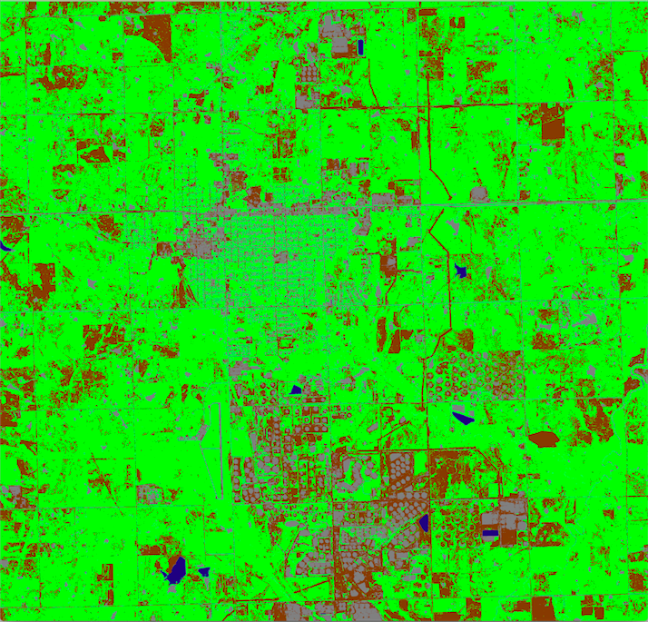
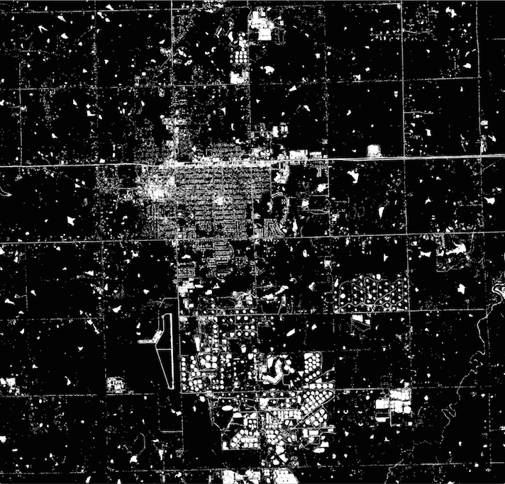

# lulc

A GBDX task that performs unsupervised land use land cover classification. There are six classes: vegetation, water, bare soil, clouds, shadows and unclassified.

The underlying algorithm classifies each pixel in the input image using spectral fitting to known material spectral signatures and certain class-specific shape and size filters. The input image must be an atmospherically compensated WorldView-2 or WorldView-3 multispectral image.

By default, the task produces an RGB image where each class is color coded.

Class     | Color               | Description
--------------|--------------------|------------
vegetation    | green [0,255,0]                    | All types of vegetation (healthy chlorophyll content)
water         | blue [0,0,128]                     | All types of water, including murky/impure wate
bare soil     | brown [128,64,0]                   | All types of soils, excluding rocks and stone
clouds        | light blue [128,255,255]           | All types of clouds excluding smoke
shadows       | purple [164,74,164]                | Shadows
unclassified  | gray [128,128,128]                 | Unclassified (equivalent to man-made materials, rock, stone)

The task can also produce a mask for selected classes, where pixels corresponding to the selected classes are white and all remaining pixels are black.

No data zones in the input image are colored black in the output image.

Here is an example of the rgb output and the corresponding unclassified mask.

  

  


**Comments**

+ Shadows may be misinterpreted as water.
+ Thin water bodies may be discarded.
+ Small vegetation patches may be lost.
+ Cloud holes are to be expected.
+ Regions than appear as bare soil in the original image and interpreted as vegetation in the LULC are due to spatial aggregation of small grass patches which are not necessary evident.
+ The shadows class contains a limited subset of the true set of all shadow regions.
+ The unclassified class can be used as a rough approximation of built-up.

## Run

In a Python terminal:

```python
import gbdxtools

gbdx = gbdxtools.Interface()

lulc = gbdx.Task('lulc')
lulc.inputs.image = 's3://gbd-customer-data/32cbab7a-4307-40c8-bb31-e2de32f940c2/platform-stories/coastal-change/images/pre'

# Run workflow and save results
wf = gbdx.Workflow([lulc])
wf.savedata(lulc.outputs.image, 'platform-stories/trial-runs/lulc')
wf.execute()
```

## Input ports

| Name  | Type |  Description | Required |
|-------|--------------|----------------|----------------|
| image | Directory | Contains input image. The input image must be a WV02/WV03 multispectral image which is atmospherically compensated. If more than one images are contained in this directory, one is picked arbitrarily. | True |
| vegetation | String | If True, the output is a vegetation mask. Default is False. | False |
| water | String | If True, the output is a water mask. Default is False. | False |
| soil | String | If True, the output is a bare soil mask. Default is False. | False |
| clouds | String | If True, the output is a cloud mask. Default is False. | False |
| shadows | String | If True, the output is a shadow mask. Default is False. | False |
| unclassified | String | If True, the output is an unclassified material mask. Default is False. | False |
| tiles | String | Number of tiles to tile input image into if it is too big. In that case, the recommended number is 2. Only use this if the default option fails. Default is 1. | False |
| verbose | String | If True, save algorithm config files in output directory. To be used for debugging purposes. Default is False. | False |

Note that if more than one class is set to True, the corresponding mask includes all the classes set to True.

## Output ports

| Name  | Type | Description                                    |
|-------|---------|---------------------------------------------------|
| image | Directory | Contains output image. |


## Development

### Build the Docker image

You need to install [Docker](https://docs.docker.com/engine/installation/).

Clone the repository:

```bash
git clone https://github.com/platformstories/lulc
```

Then:

```bash
cd lulc
docker build --build-arg PROTOUSER=<GitHub username> \
             --build-arg PROTOPASSWORD=<GitHub password> \
             -t lulc .
```

### Try out locally

Create a container in interactive mode and mount the sample input under `/mnt/work/input/`:

```bash
docker run -v full/path/to/sample-input:/mnt/work/input -it lulc
```

Then, within the container:

```bash
python /lulc.py
```

Confirm that the output image is under `/mnt/work/output/output`.

### Docker Hub

Login to Docker Hub:

```bash
docker login
```

Tag your image using your username and push it to DockerHub:

```bash
docker tag lulc yourusername/lulc
docker push yourusername/lulc
```

The image name should be the same as the image name under containerDescriptors in lulc.json.

Alternatively, you can link this repository to a [Docker automated build](https://docs.docker.com/docker-hub/builds/).
Every time you push a change to the repository, the Docker image gets automatically updated.

### Register on GBDX

In a Python terminal:

```python
import gbdxtools
gbdx = gbdxtools.Interface()
gbdx.task_registry.register(json_filename='lulc.json')
```

Note: If you change the task image, you need to reregister the task with a higher version number
in order for the new image to take effect. Keep this in mind especially if you use Docker automated build.
